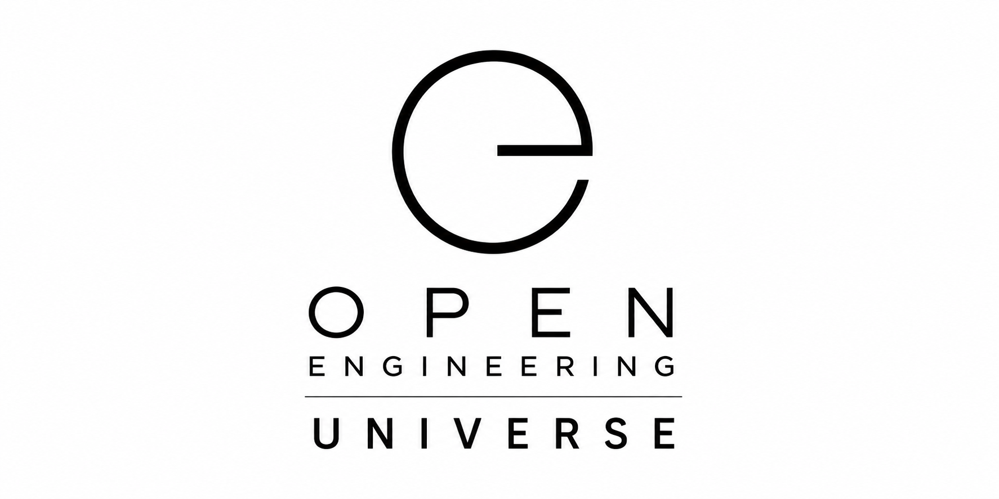

# Open Engineering Universe

**The open universe for engineering things that think, act, communicate, remember, and evolve.**

<p align="center">
  
</p>

Open Engineering Universe is the top-level home of the **Open Engineering ecosystem**.

It brings together the definitions, conventions, artifacts, skills, builders, runtimes, infrastructure, learning materials, and experiences that make Open Engineering possible.

Rather than treating software, hardware, AI, infrastructure, documentation, and engineering knowledge as separate worlds, Open Engineering places them inside one composable engineering universe.

---

## 🌌 The Universe

Open Engineering is built around a simple idea:

> **Everything should be understandable, composable, reproducible, observable, and open.**

The Universe provides the larger context in which Open Engineering concepts live and interact.

```text
Open Engineering Universe
│
├── Definitions
├── Conventions
├── Identifiers
├── Skills
│
├── Artifacts
├── Packages
│
├── Builders
├── Composers
│
├── Capsules
├── Picos
│
├── Sites
├── Sandcastles
│
├── Academy
│
└── Runtime
    ├── Kubernetes
    ├── Crossplane
    ├── FluxCD
    ├── Wrangler
    ├── Manifold
    └── Observability
```

These are not isolated products.

They are parts of one engineering language.

---

## 🧭 Four Dimensions

Open Engineering can be understood through four complementary dimensions.

### 1. Ontology

**What things are.**

Definitions establish the vocabulary and semantics of the Universe.

They describe concepts such as systems, components, artifacts, skills, capsules, composers, Picos, observations, investigations, executions, workflows, evidence, and events.

### 2. Product Model

**How things are assembled.**

Engineering elements can be combined into increasingly capable compositions.

```text
Definition
    ↓
Artifact
    ↓
Package
    ↓
Capsule
    ↓
Composition
    ↓
Pico
```

The exact composition depends on the problem being solved; the important property is that every layer remains explicit and inspectable.

### 3. Systems of Record

**Where truth lives.**

Open Engineering favors declarative, version-controlled systems of record.

Git repositories, manifests, schemas, definitions, decision records, evidence, and generated artifacts make engineering intent traceable.

### 4. Runtime Architecture

**Where things become real.**

Definitions eventually become running systems.

Kubernetes provides the execution substrate, while technologies such as Crossplane and FluxCD reconcile declared intent with runtime reality.

Open Engineering components can then be surfaced and operated through tools such as Wrangler, Manifold, and Home Assistant.

---

## 🧩 Engineering Primitives

At the heart of the Universe is a small collection of reusable primitives.

| Primitive | Purpose |
| --- | --- |
| **Observation** | Capture something that happened or exists |
| **Investigation** | Explore an observation or question |
| **Execution** | Perform an action |
| **Event** | Represent something that happened |
| **Messaging** | Communicate between participants |
| **Workflow** | Coordinate sequences of work |
| **Memory** | Preserve useful context |
| **Evidence** | Support conclusions with traceable information |
| **Reporting** | Communicate outcomes |
| **Composition** | Combine capabilities into larger systems |

These primitives can be reused across humans, software, infrastructure, AI agents, robots, simulations, and other engineered systems.

---

## 🤏 Picos

A **Pico** is a small, composable Open Engineering entity.

A Pico can expose a friendly interface, contain high-performance implementation logic, maintain durable state, communicate through events and messages, and participate in larger compositions.

A typical Pico may combine:

- **Python** for its approachable interface;
- **Rust** for fast and reliable implementation;
- **PyO3** for connecting Python and Rust;
- **SQL / durable objects** for persistent state;
- **containers** for packaging;
- **Kubernetes** for execution;
- **Crossplane** for declarative provisioning;
- **events and messaging** for collaboration.

One Pico can be tiny.

Thousands of Picos can form a living distributed system.

---

## 🧬 Capsules

Capsules package reusable engineering capabilities.

Examples include:

- Character
- Systems Thinking
- Story
- Robotics
- Voice
- Vision
- Memory
- AI
- Identity
- Documentation
- Simulation

Capsules allow sophisticated capabilities to be assembled without repeatedly rebuilding their foundations.

---

## 🎼 Composers

Individual capabilities become much more useful when they can work together.

**Composers** assemble Open Engineering elements into coherent systems and experiences.

They provide the orchestration layer through which artifacts, packages, capsules, Picos, workflows, infrastructure, and interfaces become a composition.

---

## 🏗️ Builders

**Builders** turn engineering intent into artifacts.

A builder can compile, generate, transform, validate, package, test, or publish something defined elsewhere in the Universe.

This separation keeps definitions independent from the mechanisms used to realize them.

---

## 📦 Artifacts & Packages

Open Engineering treats build outputs as first-class citizens.

Artifacts can include:

- binaries;
- Rust libraries;
- Python wheels;
- JavaScript and Node.js packages;
- container images;
- generated schemas;
- documentation;
- models;
- media;
- deployment bundles.

Packages provide the mechanisms by which these artifacts can be distributed and consumed.

The result is a traceable path from **definition → source → build → artifact → deployment → runtime**.

---

## 🏖️ Sandcastles

A **Sandcastle** is a blueprint.

It describes something worth building without pretending that the blueprint itself is the finished system.

Sandcastles provide a safe place for architecture, experiments, reference implementations, and engineering ideas to become sufficiently precise before they graduate into other parts of the Universe.

---

## 🌐 Sites

**Sites** provide human-facing experiences for Open Engineering.

They transform structured engineering knowledge into interfaces that people can explore and use.

A Site can combine conventional web experiences with interactive visualization, simulation, AI, realtime information, and spatial 2D or 3D representations.

---

## 🎓 Academy

The **Open Engineering Academy** teaches the Universe by building real things.

Courses are designed to compose rather than duplicate knowledge.

A learner might begin with:

```text
Hello, Pico!
```

and progressively encounter:

```text
Python
   ↓
Rust
   ↓
PyO3
   ↓
Containers
   ↓
Kubernetes
   ↓
Crossplane
   ↓
GitOps
   ↓
Manifold
   ↓
Home Assistant
   ↓
Distributed Picos
```

Each course can reuse capabilities introduced by previous courses.

The Academy therefore grows as a knowledge graph rather than as a pile of disconnected tutorials.

---

## 🪪 Identifiers

Everything important should be identifiable.

Open Engineering uses stable identifiers so definitions, artifacts, packages, runtime objects, evidence, and other entities can refer to one another without depending on their physical storage location.

Human-readable names provide meaning.

Machine-friendly identifiers provide identity.

Together they allow the Universe to remain navigable as it grows.

---

## 📜 Definitions & Conventions

**Definitions** explain what something means.

**Conventions** explain how we agree to represent and work with it.

Keeping these concerns explicit allows tools to reason about Open Engineering without hiding essential semantics inside application code.

This creates a foundation for parsers, validators, generators, builders, AI assistants, and autonomous engineering workflows.

---

## 🧠 Humans and AI

Open Engineering is designed for engineering teams in which humans and AI collaborate.

AI should not require a mysterious parallel representation of the system.

It should be able to work from the same:

- definitions;
- manifests;
- architecture;
- conventions;
- source;
- evidence;
- decisions;
- observations;
- workflows;
- runtime state

that humans use.

This makes AI participation inspectable and gives both humans and machines a shared engineering language.

---

## 🔄 From Idea to Reality

A concept can travel through the Universe without losing its provenance.

```text
Idea
 │
 ▼
Definition
 │
 ▼
Convention
 │
 ▼
Sandcastle
 │
 ▼
Source
 │
 ▼
Builder
 │
 ▼
Artifact
 │
 ▼
Package
 │
 ▼
Composition
 │
 ▼
Runtime
 │
 ▼
Observation
 │
 ▼
Evidence
 │
 └──────────────► Learning
                    │
                    └────► next iteration
```

The loop is intentional.

Engineering does not end at deployment.

Running systems produce observations and evidence that feed the next engineering decision.

---

## 🔭 A Universe, Not a Framework

Open Engineering is deliberately broader than a framework.

A framework normally tells you how to build software within its boundaries.

A universe establishes enough shared language that many kinds of engineering can coexist:

```text
Software
Hardware
Robotics
Infrastructure
AI
Voice
Vision
Simulation
Documentation
Architecture
Education
Storytelling
Physical systems
```

The goal is not to force all of these into one implementation.

The goal is to make them **composable**.

---

## 🌱 Open by Design

Open Engineering favors technologies and formats that can be understood, inspected, reproduced, extended, and self-hosted.

That means preferring:

- open standards;
- open-source implementations;
- declarative configuration;
- portable artifacts;
- local-first development where practical;
- reproducible builds;
- observable systems;
- explicit interfaces;
- version-controlled knowledge;
- replaceable components.

No single vendor should define the boundary of the Universe.

---

## ✨ The Destination

Imagine an engineering environment where you can zoom from an entire organization...

to a system...

to a composition...

to a Pico...

to its package...

to an artifact...

to its source...

to the decision that created it...

to the evidence behind that decision...

and finally to what is happening inside the running system **right now**.

All without leaving the same conceptual universe.

That is **Open Engineering Universe**.

---

<p align="center">
  <strong>Define openly. Compose freely. Build reproducibly. Run anywhere.</strong>
</p>

<p align="center">
  <a href="https://open-engineering.io">open-engineering.io</a>
</p>
